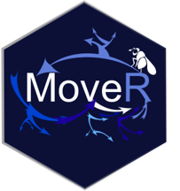
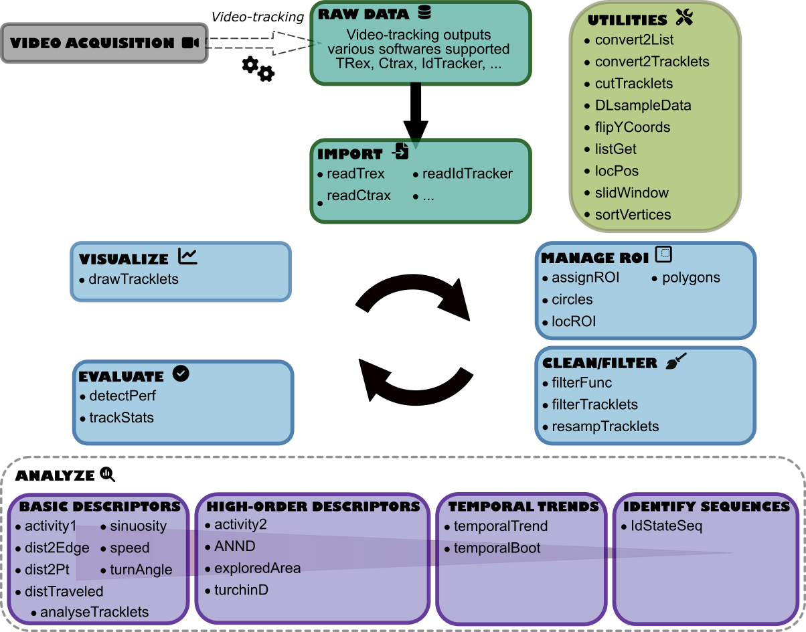

<!-- README.md is generated from README.Rmd. Please edit that file -->

# MoveR 

<!-- badges: start -->

</br>

</br>
</br>


<!-- badges: end -->

The `MoveR`

package aims to help users analyze the output of automated video
tracking solutions in a reproducible, reliable and open framework.

## Dependencies

In a sack of flexibility, `MoveR` is mainly coded using base
.</br>
However it still relies on a few dependencies:


 
<a href="https://www.rdocumentation.org/packages/graphics/">graphics</a>,
<a href="https://www.rdocumentation.org/packages/grDevices">grDevices</a>
and <a href="https://www.rdocumentation.org/packages/hexbin">hexbin</a>
to load R functions for base graphics.</br>

  <a href="https://github.com/r-lib/progress">progress</a> to display a
progress bar showing the advancement of the computations.</br>

 
<a href="https://www.rdocumentation.org/packages/reticulate">reticulate</a>
and
<a href="https://www.rdocumentation.org/packages/R.matlab">R.matlab</a>
to import <a href="https://https://www.python.org/">Python</a> and
<a href="https://mathworks.com/products/matlab.html">Matlab</a>
formatted data.</br>

  <a href="https://www.rdocumentation.org/packages/stats">stats</a> to
load R functions for basic calculations.</br>

  <a href="https://www.rdocumentation.org/packages/trajr">trajr</a> to
load R functions to compute basic movement metrics (e.g., speed,
sinuosity).</br>

## Installation

You can install the development version from
[GitHub](https://github.com/) with:

``` r
# install.packages("remotes")
remotes::install_github("qpetitjean/MoveR")
```

Then you can attach the package `MoveR`:

``` r
library("MoveR")
```

## Overview

`MoveR` is an R package allowing to import, clean/filter and analyze raw
particles/animals movement data from video tracking software.</br>

### Main workflow steps

More particularly, `MoveR` provides tools to:</br>

  <strong>IMPORT</strong> the raw data from various tracking software
such as <a href="https://trex.run">TRex</a>,
<a href="https://swarm-lab.github.io/trackR">trackR</a>,
<a href="https://ctrax.sourceforge.net/">Ctrax</a> and
<a href="https://idtrackerai.readthedocs.io/en/latest/">idtracker.ai</a>
(other can be implemented on demand).</br></br>

  <strong>CLEAN/FILTER</strong> the data according to custom functions
specified by the user. For instance, it can easily remove suspected
tracking errors based on expected particles’ size or speed. It is also
possible to sample the particles’ tracks according to a specified time
step or remove part of the tracks that are detected outside an arena or
a given area.</br></br>

  <strong>EVALUATE</strong> the quantity of data removed over the
cleaning/filtering process and check the amount of true and false
detection compared to manual annotations.</br></br>

  <strong>VISUALIZE</strong> the tracks of all or specified particles
over time.</br></br>

  <strong>ANALYSE</strong> the data over tracks, time, or space. It is
possible to compute low (basics) or high (advanced) level metrics over
each track and temporal and spatial trends. In a nutshell, Low and
High-level metrics return the results of a given computation over each
track, while temporal trends functions return the results of a given
calculation over time by averaging the value of each track. It is also
possible to compute a studentized 95% confidence interval by
bootstrapping over the tracks. Also, it is possible to extract specified
spatial trends according to a given pattern set by the user.</br>

### Breakthrough

Besides the high flexibility, the primary implementation brought by
`MoveR` is the possibility to:</br>

  <strong>characterize behavioral states</strong> (i.e., active
vs. inactive momentum) using unsupervised learning methods (i.e.,
density-based clustering - see actives2 function).</br></br>

  <strong>compute the Turchin’s net square displacement</strong>, a
proxy of population dispersion assuming correlated random walk (see
turchinD function). </br></br>

  <strong>extract specified patterns</strong> of behavioral states,
visited areas, or any other custom patterns.



## Working example

<strong>IN PROGRESS</strong>

## Citation

Please cite this package as:

> PETITJEAN Quentin (2022) MoveR: An R package to ease animal movement
> analyses. R package version 0.0.0.9000.

## Code of Conduct

Please note that the `MoveR` project is released with a [Contributor
Code of
Conduct](https://contributor-covenant.org/version/2/0/CODE_OF_CONDUCT.html).
By contributing to this project, you agree to abide by its terms.
