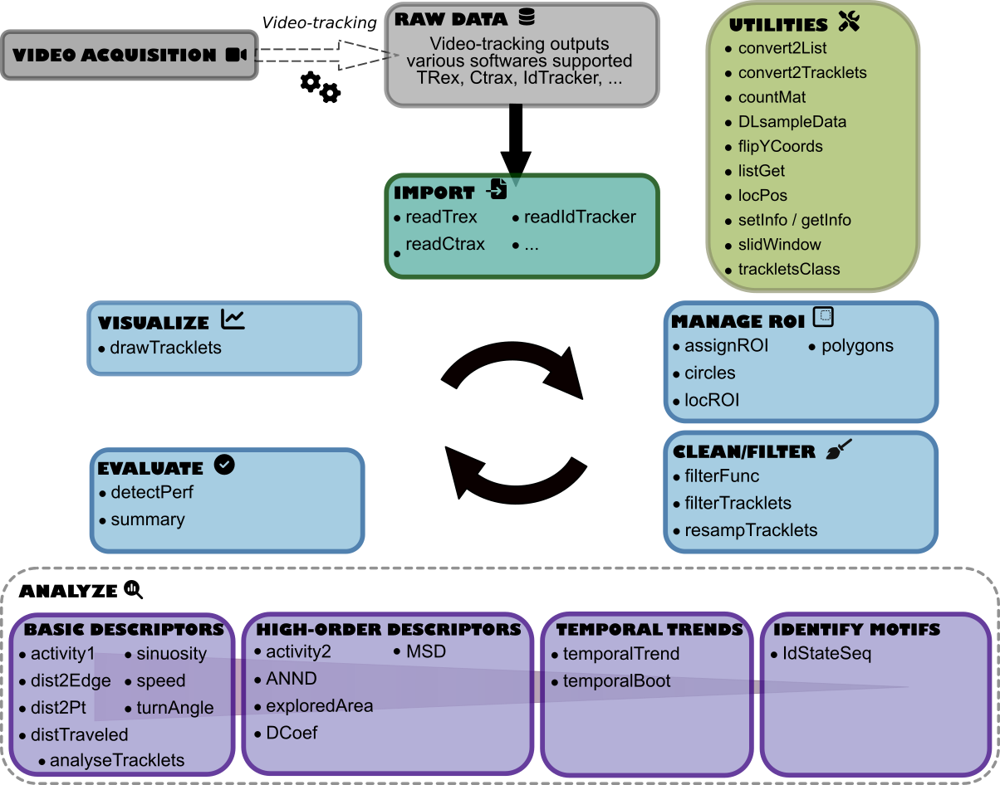

<!-- README.md is generated from README.Rmd. Please edit that file -->

# MoveR 

<!-- badges: start -->

<br />
<br />
<br />
 
<br />

<!-- badges: end -->

The `MoveR` package aims to help users analyze the output of automated
video tracking solutions in a reproducible, reliable and open framework.

## Dependencies

In a sack of flexibility, `MoveR` is mainly coded using base .<br />
However it still relies on a few dependencies:<br />

<ul>
<li>
<a href="https://www.rdocumentation.org/packages/graphics/">graphics</a>,
<a href="https://www.rdocumentation.org/packages/grDevices">grDevices</a>
and <a href="https://www.rdocumentation.org/packages/hexbin">hexbin</a>
to load R functions for base graphics.
</li>
<br />
<li>
<a href="https://github.com/r-lib/progress">progress</a> to display a
progress bar showing the advancement of the computations.
</li>
<br />
<li>
<a href="https://www.rdocumentation.org/packages/reticulate">reticulate</a>
and
<a href="https://www.rdocumentation.org/packages/R.matlab">R.matlab</a>
to import <a href="https://https://www.python.org/">Python</a> and
<a href="https://mathworks.com/products/matlab.html">Matlab</a>
formatted data.
</li>
<br />
<li>
<a href="https://www.rdocumentation.org/packages/stats">stats</a> to
load R functions for basic calculations.
</li>
<br />
<li>
<a href="https://www.rdocumentation.org/packages/trajr">trajr</a> to
load R functions to compute basic movement metrics (e.g., speed,
sinuosity).
</li>
<br />
</ul>

## Installation

You can install the development version from
[GitHub](https://github.com/) with:

``` r
# install.packages("remotes")
remotes::install_github("qpetitjean/MoveR")
```

Then you can attach the package `MoveR`:

``` r
library("MoveR")
```

To update with the latest version, first remove the package:

``` r
detach("package:MoveR", unload=TRUE)
remove.packages("MoveR")
```

and repeat the above installation commands.

## Overview

`MoveR` is an package allowing to import, clean/filter and analyze raw
particles/animal movement data obtained from video-tracking
softwares.<br />

### Main workflow steps

More particularly, `MoveR` provides tools to:<br />

<ul>
<li>
<strong>IMPORT</strong> the raw data from various tracking software such
as <a href="https://trex.run">TRex</a>,
<a href="https://swarm-lab.github.io/trackR">trackR</a>,
<a href="https://ctrax.sourceforge.net/">Ctrax</a> and
<a href="https://idtrackerai.readthedocs.io/en/latest/">idtracker.ai</a>
(other can be easily implemented if needed).
</li>
<br />
<li>
<strong>CLEAN/FILTER</strong> the data according to custom functions
specified by the user. For instance, it can easily remove suspected
tracking errors based on expected particles’ size or speed. It is also
possible to sample the particles’ tracks according to a specified time
step or remove part of the tracks that are detected outside an arena or
a given area.
</li>
<br />
<li>
<strong>EVALUATE</strong> the quantity of data removed over the
cleaning/filtering process and check the amount of true and false
detection compared to manual annotations.
</li>
<br />
<li>
<strong>VISUALIZE</strong> the tracks of all or specified particles over
time.
</li>
<br />
<li>
<strong>ANALYSE</strong> the data over tracks, time, or space. It is
possible to compute low (basics) or high (advanced) level metrics over
each track and temporal and spatial trends. In a nutshell, Low and
High-level metrics return the results of a given computation over each
track, while temporal trends functions return the results of a given
calculation over time by averaging the value of each track. It is also
possible to compute a studentized 95% confidence interval by
bootstrapping over the tracks. Also, it is possible to extract specified
spatial trends according to a given pattern set by the user.
</li>
<br />
</ul>

### Innovative features

Besides the high flexibility and unified environment, the primary
innovations provided by `MoveR` are the possibility to:<br />

<ul>
<li>
<strong>Behavioral classification: </strong> Discriminate active
vs. inactive states using an unsupervised method (density-based clustering) - see the actives2 function.
</li>
<br />
<li>
<strong>Movement upscaling: </strong> Compute the expected diffusion coefficient (D) as a proxy
of long-term dispersal, assuming a correlated random walk model (from
Turchin’s 1998; see turchinD function).
</li>
<br />
<li>
<strong>Pattern identification: </strong> Identify and extract arbitrary patterns in terms of
changes of behavioral states, spatial position or areas of interest (e.g. 
boundary crossing, patch changes, ...)  using a very versatile
regular-expression syntax.
</li>
</ul>



## Citation

Please cite this package as:

> PETITJEAN Quentin (2023) MoveR: An R package to ease animal movement
> analyses. R package version 0.0.0.9000.

## Code of Conduct

Please note that the `MoveR` project is released with a [Contributor
Code of
Conduct](https://contributor-covenant.org/version/2/0/CODE_OF_CONDUCT.html).
By contributing to this project, you agree to abide by its terms.
